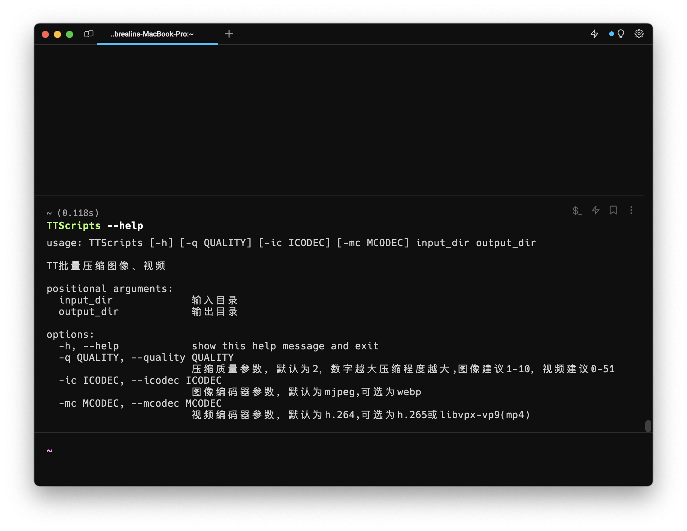

# TTBatachCompressScripts

基于 FFmpeg 的一个简单脚本，可以较方便的批量压缩图片与视频

## FFmpeg

该脚本基于 [FFmpeg](https://ffmpeg.org) 命令实现，所以需要提前下载好相关组件

下载地址：<https://ffmpeg.org/download.html#releases>

> Win 建议使用 winget 安装；Mac 建议使用 HomeBrew 安装

## 命令结构

`TTScripts input_dir out_dir [-q] [-ic] [-mc]`

### 可选

-q：图像或视频的压缩程度、质量，通常数值越高压缩程度越高，体积大小越小，默认为 2

-ic：图像编码器参数，默认为 mjpeg，可选为 webp

-mc：视频编码器参数，默认为 H.264，可选为 H.265 或 libvpx-vp9（仅 MP4）

## 使用

示例：

`python TTScripts input_dir output_dir -q 8 -ic webp`

或

`python TTScripts input_dir output_dir -q 20`

> 可能会出现 `already exists. Overwrite? [y/N]` 提示文件已存在是否覆写，输入 y 继续即可，或者输入 n 拒绝

### 单图像或视频压缩

可使用如下命令

`python TTScripts single_file output_dir `

### 环境变量

可根据不同系统配置 PATH 环境变量实现全局调用

Mac 为例：

添加 `#!/usr/local/bin/env python` 至 `TTScripts.py` 行首

再将 `TTScripts.py` 移动至可执行文件目录 `/usr/local/bin` 下

可使用如下命令移动即可

`sudo cp TTScripts.py /usr/local/bin/hello`

> 如遇调用失败，可输入命令 `chmod +x TTScripts.py` 添加可执行权限

最后可类似如下直接调用

`TTScripts input_dir output_dir`